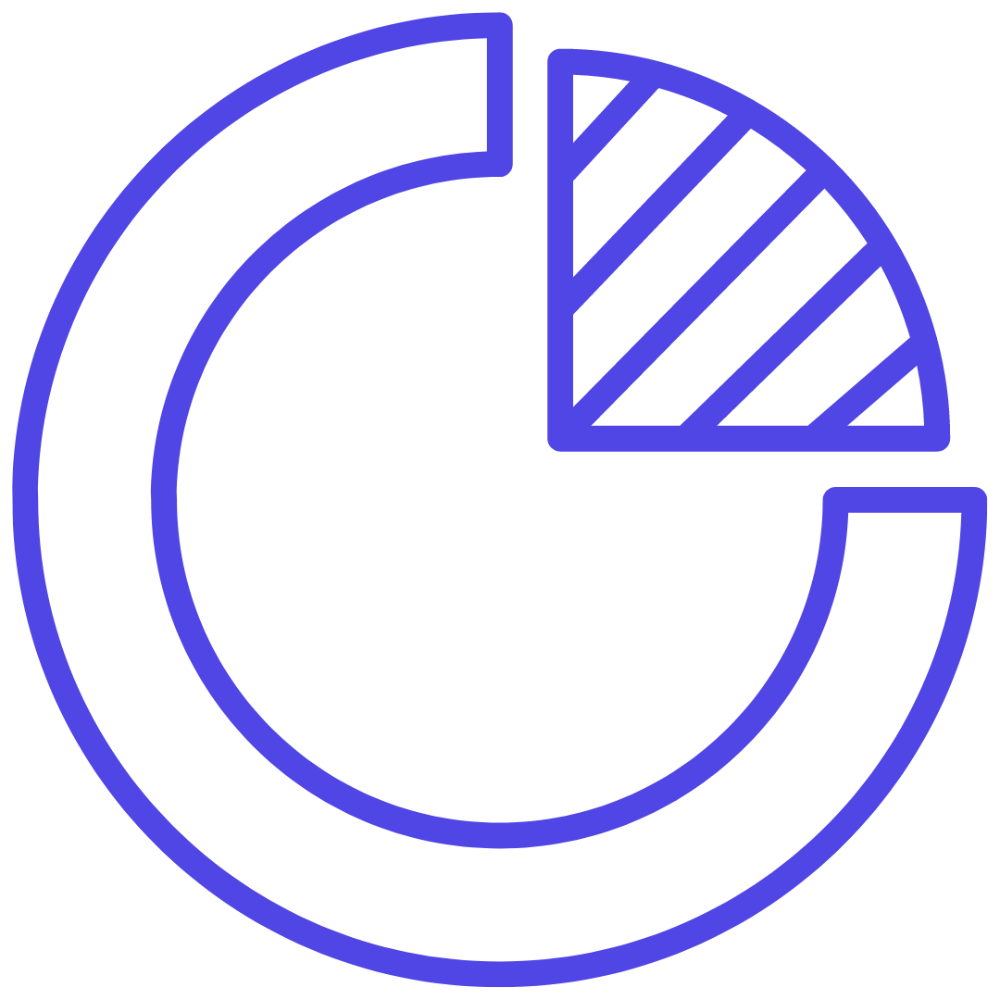
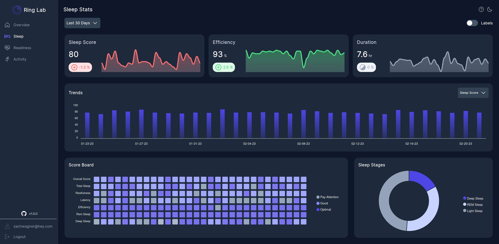

 
<h1>RingLab</h1>

<h3 align="center">An Analytics Dashboard for your 
  
    <a href='https://ouraring.com/'>Oura Ring.</a>
  
</h3>

  

 

# Features
🛡️ Secure OAuth2 Login via your Oura Account.

🕑 Multi Time Frame. Today, Last 7 Days, Last 30 Days, This Year.

📈 Trends chart to see your stats over a period of time.

🥅 Score Board Heatmap to view your scores and see them ranked (Pay Attention, Good, Optimal).

🍩 Donut Chart to view Sleep Stages and Activity Zone time.

🌙 Dark Mode.

📱 Responsive mobile support!

# F.A.Q.

coming soon!

