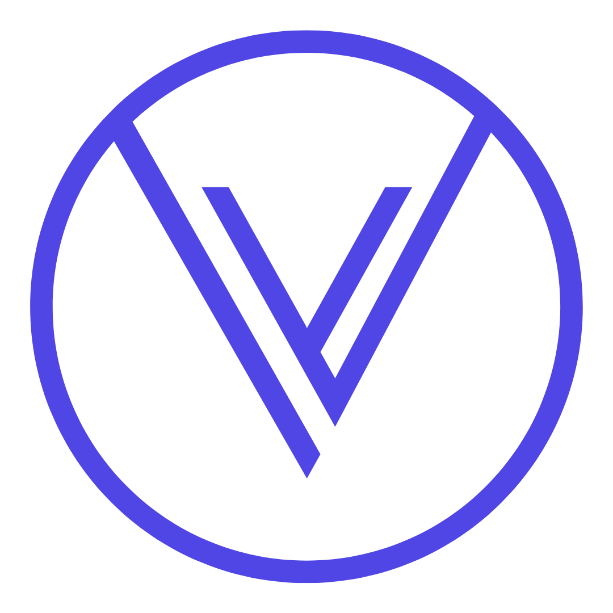
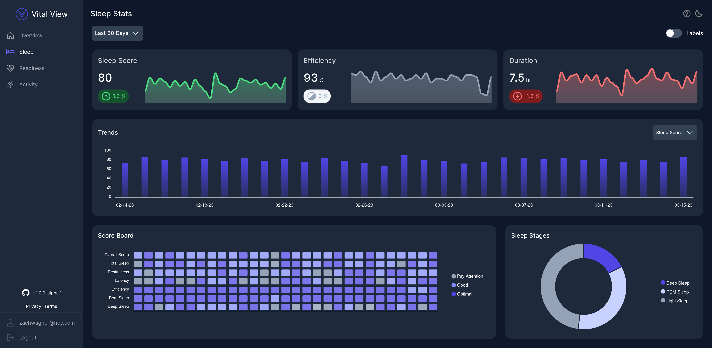

<div align="center">
 
<h1>Vital View</h1>
</div>
<h3 align="center">An Analytics Dashboard for your 
  <span>
    <a href='https://ouraring.com/'>Oura Ring.</a>
  </span>
</h3>
<div align="center">

  <a href='https://vitalview.app'>
  </a>
</div>

<p align="center">
 
</p>

# Features
🛡️ Secure OAuth2 Login via your Oura Account.

🕑 Multi Time Frame. Today, Last 7 Days, Last 30 Days, This Year.

📈 Trends chart to see your stats over a period of time.

🥅 Score Board Heatmap to view your scores and see them ranked (Pay Attention, Good, Optimal).

🍩 Donut Chart to view Sleep Stages and Activity Zone time.

🌙 Light/Dark Mode.

📱 Responsive mobile support!

# Contributing
If you would like to contribute to this project, please start a discussion and/or submit a PR!

* You will need an Oura Client ID & Secret. These can be obtained from https://cloud.ouraring.com/docs
* Add the following as a redirect URI http://localhost:3000/api/auth/callback/oura


To develop locally, fork the repo and setup an .env.local with the following config.

```
# Next Auth
# You can generate the secret via 'openssl rand -base64 32' on Linux
# More info: https://next-auth.js.org/configuration/options#secret

NEXTAUTH_SECRET=YOUR_NEXTAUTH_SECRET
NEXTAUTH_URL=http://localhost:3000/

# Next Auth Oura Provider
OURA_CLIENT_ID=YOUR_CLIENT_ID
OURA_CLIENT_SECRET=YOUR_CLIENT_SECRET
```
then

```
pnpm i 
pnpm dev
```
------

<div align="center">

<a href='https://www.buymeacoffee.com/zachxwagner'></a>
<p>
</div>


